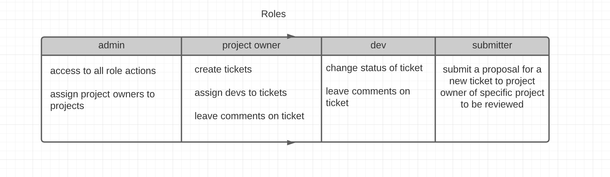

# MVP

### Hosting on Heroku (10/3/2020)

### Login, demo user
- users can create an account 
    - users only see list of project until assinged a role
- users can't use site without logging in
- demo users (for each role) can login to use the site
- based off role of the user, user can only access certain pages

### Roles

- logged in as admin: 
    - assign roles to users in db
    - view all projects and tickets (search/filter)
    - create a ticket
    - assign project owners to projects
    - assign devs to tickets
    - delete a ticket
    - leave comments on tickets
    - edit status of ticket
    - edit level of severity of ticket

- logged in as project manager: 
    - review submitted ticket proposals
    - create tickets
    - assign devs to tickets
    - delete a ticket
    - edit level of severity of a ticket
    - see list of all tickets assigned (search / filter)

- logged in as a dev: 
    - edit status of a ticket
    - leave comment on ticket
    - see list of all tickets and projects assigned to dev ( search / filter )

- logged in as submitter
    - displayed a form to submit a proposal to project owner to make a ticket

## Bonus 
- search/filter ticket and project results
- theme change based off of role signed in as

